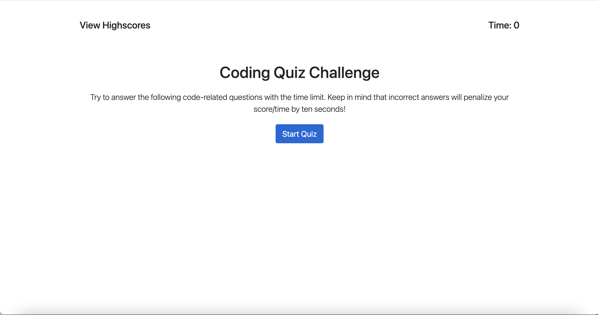

# Code Quiz

## Description
When the user clicks start, the timer starts and the questions are displayed. When the user clicks on any of the choices, they are taken to the next question. 10 seconds will be deducted from the timer if you answer the question wrong. When the timer reaches 0 or all the questions are answered, the user is taken to the score and initial input page. The user will input their initials and click submit. After the submit button is click the score and initials will be stored in localStorage and the previous 5 scores will be displayed.

## Screenshot

## Features
* HTML
* Javascript
* Bootstrap
